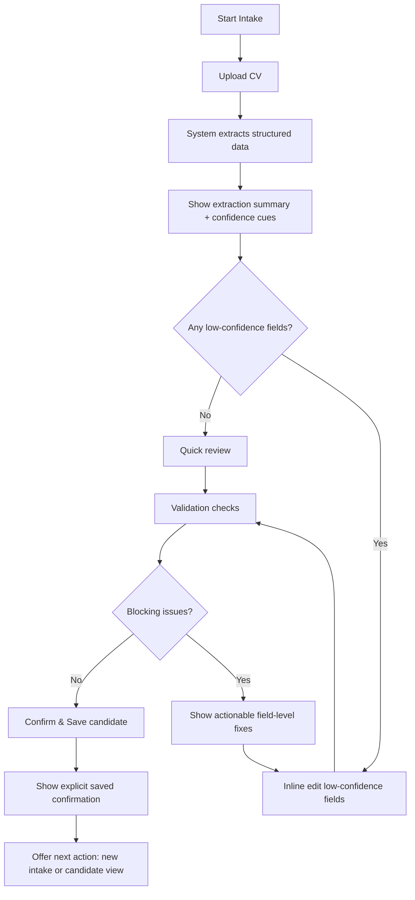
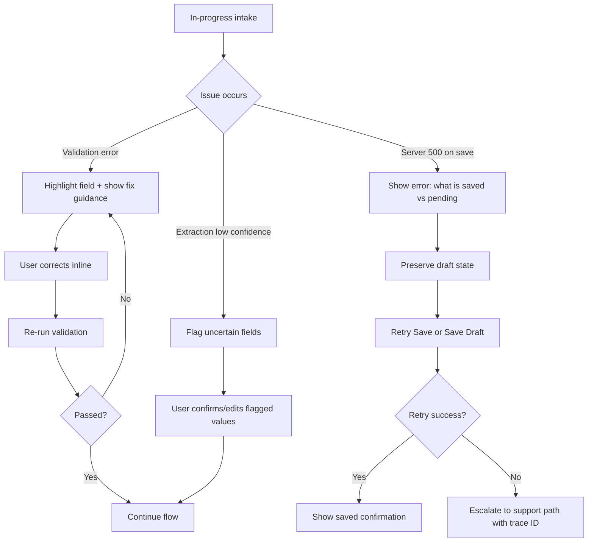
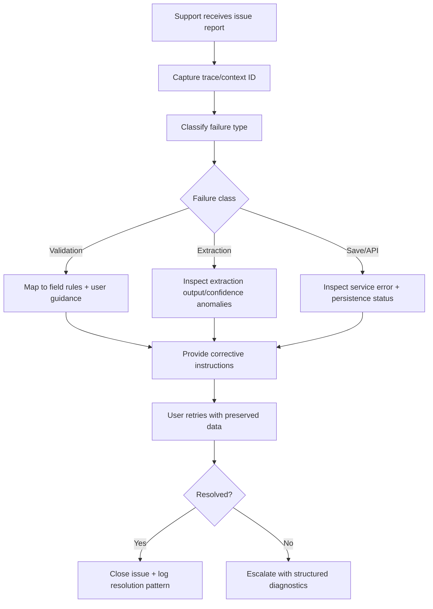

# UX Design Specification AI4Devs-tdd-202602-Seniors

**Author:** PB
**Date:** 2026-04-16

---

<!-- UX design content will be appended sequentially through collaborative workflow steps -->

## Executive Summary

### Project Vision

AI4Devs-tdd-202602-Seniors is a brownfield recruiter workflow platform focused on reliable, end-to-end candidate intake. The UX vision is operational confidence: recruiters should be able to submit complete candidate records quickly, recover from errors gracefully, and trust that the system preserves data integrity across the full intake flow.

### Target Users

- **Primary Users (Recruiters):** Need fast, low-friction candidate entry with clear validation and dependable submission outcomes.
- **Secondary Users (Support/Technical):** Need diagnosable flows and explicit failure states to investigate issues efficiently.
- **Secondary Users (Operations/Admin):** Need confidence that intake workflows remain stable as features evolve, with reduced regression risk.

### Key Design Challenges

- **High-stakes form complexity:** Multi-section candidate intake (personal details, education, work experience, CV) must feel manageable, not overwhelming.
- **Error recovery under time pressure:** Users must correct invalid/missing inputs without losing progress or restarting.
- **Trust and clarity in system feedback:** Success, validation, and failure states must be explicit and actionable to avoid silent uncertainty.

### Design Opportunities

- **Guided intake flow:** Structure the experience into clear progressive steps that reduce cognitive load and improve completion reliability.
- **Actionable validation UX:** Provide precise, field-level guidance and recovery paths that turn errors into quick corrections.
- **Confidence-oriented interaction design:** Use confirmations, continuity cues, and transparent status feedback to reinforce user trust in data persistence.

## Core User Experience

### Defining Experience

The core experience is turning unstructured candidate CV input (primarily PDF) into standardized, editable candidate data with minimal recruiter effort. The product should feel like an intelligent intake assistant: recruiters provide source material, the system structures it, and users quickly verify/correct rather than manually re-enter everything.

### Platform Strategy

- **Primary platform:** Web-only.
- **Interaction model:** Mouse/keyboard workflows optimized for recruiter desktop usage.
- **Flow priority:** Form verification and correction workflows after automated extraction.
- **Reliability expectation:** Web interactions must provide explicit states for processing, success, validation issues, and failures.

### Effortless Interactions

- Recruiters can upload a CV and receive pre-filled structured candidate fields automatically.
- Recruiters can review and adjust extracted values inline without restarting the flow.
- Repetitive manual entry is minimized by default through extraction-first UX.
- The system clearly highlights uncertain or low-confidence extracted fields for quick user confirmation.

### Critical Success Moments

- **Primary success moment:** Recruiter sees accurate, standardized data auto-populated from an uploaded CV and can finalize quickly.
- **Trust moment:** The system transparently shows what was extracted and what still needs user confirmation.
- **Make-or-break failure:** A `500` error during intake or extraction immediately undermines trust and must be handled with clear recovery guidance.

### Experience Principles

- **Extraction-first, verification-second:** Prioritize automatic structuring before manual data entry.
- **Clarity over magic:** Show system decisions clearly so recruiters can trust and correct them.
- **Fast correction loops:** Make editing extracted data faster than manual full-form completion.
- **Failure transparency:** Never fail silently; provide actionable recovery paths for system errors.

## Desired Emotional Response

### Primary Emotional Goals

- **Primary emotional goal:** Satisfaction after completing candidate intake quickly and accurately from CV extraction.
- **Secondary emotional goal:** Clarity throughout review and correction steps so users always understand system state and required actions.
- **Trust goal:** Users feel their work is safe, even when errors occur.

### Emotional Journey Mapping

- **Entry state:** User starts with cautious optimism, expecting time savings from automatic extraction.
- **Core interaction state:** User feels clarity and control while reviewing extracted fields and making targeted corrections.
- **Completion state:** User feels satisfied and confident that submitted data is complete and reliable.
- **Failure/recovery state:** If an error occurs (especially server failures), user should feel protected from data loss and clearly guided to recovery.

### Micro-Emotions

- **Confidence over doubt:** Users trust extracted values when evidence/state is clear.
- **Control over helplessness:** Users can always edit, retry, and recover without losing partial input.
- **Relief over anxiety:** Critical flows communicate progress, success, and failure states explicitly.
- **Trust over skepticism:** System behavior is predictable and transparent.

### Design Implications

- Autosave or session-preservation patterns should protect partially entered/reviewed data during failures.
- Error states must explicitly communicate what was saved, what failed, and what the next safe action is.
- Extraction results should include confidence cues so uncertain fields are easy to verify.
- Review UX should prioritize readability and correction speed (clear labels, inline edits, focused validation feedback).
- Candidate-position fit indicator should be visible, stable, and explainable enough to feel reliable.

### Emotional Design Principles

- **Preserve user effort:** Never lose user work silently.
- **Clarity at every state:** Processing, partial success, failure, and completion must be unambiguous.
- **Confidence through transparency:** Show extraction certainty and where user validation is needed.
- **Satisfaction through dependable outcomes:** Fast, predictable completion beats flashy interactions.
- **Decision support with trust:** Match indicators should aid judgment without feeling opaque or arbitrary.

## UX Pattern Analysis & Inspiration

### Inspiring Products Analysis

**LinkedIn (Recruiter-oriented usage patterns)**
- **Strength observed:** Powerful filtering workflows that help users narrow large candidate pools quickly.
- **UX value:** Supports fast decision-making through progressive refinement and high-control search criteria.
- **Relevant lesson for this product:** Candidate extraction output should be easy to filter/segment by confidence, completeness, and role fit signals.

**Adobe Acrobat (document workflows + AI extraction/classification trends)**
- **Strength observed:** Strong document conversion utilities and increasingly intelligent extraction/classification experiences.
- **UX value:** Turns unstructured files into usable outputs while preserving user trust through visible processing states.
- **Relevant lesson for this product:** CV upload and extraction should feel like a reliable document intelligence workflow with clear status, structured output, and correction support.

**Airtable-style data workflow UX (reference pattern)**
- **Strength observed:** Clear editable tabular structures with fast inline correction and lightweight data operations.
- **UX value:** Makes structured data review and correction fast, especially for semi-structured imported content.
- **Relevant lesson for this product:** Extracted candidate fields should be reviewable/editable in a clear, low-friction structure rather than buried in long forms.

### Transferable UX Patterns

**Navigation Patterns**
- Progressive filtering and narrowing patterns from LinkedIn can support recruiter control after extraction.
- State-first navigation (processing -> review -> correction -> completion) can reduce uncertainty in CV workflows.

**Interaction Patterns**
- Extraction-first, review-second interaction from Acrobat-like flows aligns with your core UX strategy.
- Inline, fast correction patterns (Airtable-style) can reduce friction when fixing low-confidence extracted fields.
- Clear processing feedback with deterministic outcome states (success/partial/failure) builds trust.

**Visual Patterns**
- Confidence indicators and completeness cues can make extraction quality immediately legible.
- Dense but readable information hierarchy supports recruiter productivity in high-volume scenarios.
- Structured grouping of extracted fields by domain (identity, education, experience, skills) improves scanability.

### Anti-Patterns to Avoid

- Opaque black-box extraction results with no explanation or confidence visibility.
- Error messaging that reports failure without clarifying what was saved vs lost.
- Overly long monolithic forms that force full manual re-entry after partial extraction.
- Filtering/search interfaces that hide active criteria or make resets hard to understand.
- AI-generated classifications presented as absolute truth without easy override/edit capability.

### Design Inspiration Strategy

**What to Adopt**
- High-control filter patterns for review/triage workflows (LinkedIn-inspired).
- Clear extraction processing and status communication (Acrobat-inspired).
- Fast inline correction for structured extracted fields (Airtable-style editing patterns).

**What to Adapt**
- Simplify filter complexity for recruiter intake context (focus on completeness, confidence, fit relevance).
- Adapt document-intelligence UX toward candidate-profile verification rather than generic file tooling.
- Tune tabular editing patterns to maintain readability for both summary and detail-level candidate review.

**What to Avoid**
- Any extraction UX that obscures uncertainty or prevents user correction.
- Any failure mode that can lead users to believe data is saved when it is not.
- Over-automation patterns that reduce user trust by removing transparent control.

## Design System Foundation

### 1.1 Design System Choice

Use a **themeable established design system** based on the existing `react-bootstrap` foundation, extended with a lightweight custom theme layer tailored to recruiter workflows.

### Rationale for Selection

- **Brownfield fit:** `react-bootstrap` is already present in the project, minimizing migration risk and rework.
- **Delivery speed:** Enables faster UX implementation with proven components and patterns.
- **Consistency:** Supports coherent form, table, alert, and feedback patterns across candidate intake flows.
- **Maintainability:** Reduces custom-component surface area while keeping enough flexibility for product-specific interaction design.
- **Accessibility baseline:** Established components provide a stronger starting point for keyboard/focus semantics than fully custom UI from scratch.

### Implementation Approach

- Standardize core component usage for:
  - form fields and validation states,
  - extraction review panels,
  - tables/lists for structured candidate data,
  - alerts/status banners for processing/success/failure.
- Define a small reusable UI pattern set for extraction-specific needs:
  - confidence indicators,
  - field-level uncertainty highlighting,
  - save/retry/recovery status messaging.
- Build UX in iterative layers:
  1. base consistency with bootstrap components,
  2. extraction workflow components,
  3. visual polish and refinement.

### Customization Strategy

- Apply a **professional, conservative visual style** aligned with recruiter productivity use cases.
- Introduce lightweight design tokens (color, spacing, typography, status semantics) to unify behavior and visuals.
- Prioritize clarity over decorative styling, especially in high-density review/edit views.
- Defer non-essential theming complexity (e.g., dark mode expansion) until core workflow reliability is proven.
- Preserve component-level override patterns so future phases can evolve brand expression without rewriting the foundation.

## 2. Core User Experience

### 2.1 Defining Experience

The defining interaction for this product is:

**Upload CV -> auto-extract -> review/edit -> confirm/save candidate**

This interaction is the product's core value loop. If this loop is fast, clear, and reliable, users perceive the entire product as successful.

### 2.2 User Mental Model

Users approach this flow expecting:
- document intelligence similar to Acrobat-style extraction,
- rapid correction behavior similar to spreadsheet/table editing,
- deterministic outcomes where effort is preserved and system state is explicit.

They expect the system to do the heavy lifting first, then let them validate and refine efficiently.

### 2.3 Success Criteria

The defining experience is successful when:
- users complete candidate profile creation with minimal manual typing,
- extracted data is clear enough to verify quickly,
- users can correct uncertain fields without restarting,
- completion feedback clearly confirms what is saved,
- no user work is lost if errors occur during processing or save.

### 2.4 Novel UX Patterns

This product does **not** require radically new interaction metaphors.
It combines established patterns in a focused workflow:

- established upload + processing state patterns,
- established inline edit/verification patterns,
- established validation and recovery feedback patterns.

Innovation is in orchestration quality and reliability, not in unfamiliar interaction paradigms.

### 2.5 Experience Mechanics

**1. Initiation**
- User starts intake by uploading a CV file.
- UI sets expectation for automated extraction and review.

**2. Interaction**
- System extracts structured candidate data from unstructured CV input.
- UI presents grouped extracted fields with confidence cues.
- User edits uncertain/incorrect fields inline and can add missing values.

**3. Feedback**
- System communicates processing state, extraction result quality, and required user actions.
- Validation feedback is field-level and actionable.
- Errors (including server-side failures) state what happened, what is preserved, and next recovery action.

**4. Completion**
- User confirms and saves standardized candidate profile.
- UI provides explicit saved confirmation and clear post-save next actions.
- System preserves trust through transparent state and no silent data loss.

## Visual Design Foundation

### Color System

Use a professional, conservative palette optimized for trust, clarity, and workflow reliability.

**Color strategy**
- Neutral-first base for readability and focus.
- Controlled accent usage for key actions and states.
- Semantic status colors for success, warning, error, and info.
- Confidence indicators (for extraction quality) represented with clear, non-ambiguous state color mapping.

**Proposed semantic mapping**
- **Primary:** deep blue (trust, control, system reliability)
- **Secondary:** slate/neutral gray (structure, hierarchy, non-primary actions)
- **Success:** green (validated/saved states)
- **Warning:** amber (needs review, low-confidence extraction, incomplete fields)
- **Error:** red (blocking issues, failed save/extraction states)
- **Info:** blue/cyan variant (process updates, guidance, non-blocking notices)
- **Surface/background:** light neutral tones for reduced visual fatigue in high-frequency data entry usage.

**Accessibility**
- Maintain WCAG-compliant contrast for all text and interactive states.
- Do not rely on color alone for meaning; pair states with iconography/labels.

### Typography System

Adopt a high-legibility sans-serif strategy suitable for form-heavy and data-dense workflows.

**Typography strategy**
- System/modern sans-serif stack for consistency and performance.
- Strong hierarchy for sectioning extraction review vs edit actions.
- Moderate line height and compact-but-readable scale for balanced density.

**Type scale intent**
- **H1/H2:** section framing and workflow stage clarity.
- **H3/H4:** sub-group labels (identity, education, experience, skills).
- **Body:** primary reading/edit context.
- **Meta/caption:** confidence notes, timestamps, helper text, status hints.

**Tone expression**
- Professional and calm.
- Clarity-first wording and formatting.
- Minimal decorative typography.

### Spacing & Layout Foundation

Use a balanced spacing system that supports readability while preserving operational efficiency.

**Spacing strategy**
- 8px base spacing unit for coherent rhythm.
- Balanced spacing between groups to avoid both crowding and wasted space.
- Tighten spacing in repetitive data rows; increase spacing in decision-critical blocks.

**Layout foundation**
- Responsive web layout optimized for desktop recruiter workflows.
- Clear zone separation:
  1. intake/upload initiation
  2. extraction result review
  3. inline correction/edit
  4. validation summary and save/confirm
- Prefer card/section grouping for extracted domains.
- Keep primary actions persistent and predictable in location.

### Accessibility Considerations

- Keyboard-first interaction support across upload, review, edit, and save flows.
- Programmatic label association for all editable fields and validation messages.
- Visible focus states across all actionable components.
- Error messaging must be explicit, field-linked, and recovery-oriented.
- Confidence indicators should be screen-reader interpretable and not color-only.
- Maintain readable text sizing and interaction targets for sustained operational use.

## Design Direction Decision

### Design Directions Explored

Three visual directions were explored via interactive mockups:

- **Direction A - Guided Step Flow:** Sequential, structured workflow with clear progress and stage-based completion.
- **Direction B - Table Verification Workspace:** Dense, inline-edit workspace optimized for high-volume correction speed.
- **Direction C - Dual Pane Confidence Review:** Source-to-structured transparency model with explicit confidence and recovery messaging.

### Chosen Direction

**Chosen baseline:** Direction A (Guided Step Flow)  
**Integrated enhancement:** Direction C status and guidance behavior and messaging model.

The final direction keeps a clear, step-based recruiter journey while adopting robust trust and recovery feedback patterns from C.

### Design Rationale

- **Clarity-first flow:** A best supports predictable progression for upload -> extraction -> review/edit -> save.
- **Trust under failure:** C contributes stronger reliability communication, especially around save failures and partial state.
- **Balanced density alignment:** A provides readable structure; C-style guidance avoids hidden system states without overloading the interface.
- **Emotional goal fit:** This combination best supports satisfaction, clarity, and confidence while reducing fear of data loss.

### Implementation Approach

- Use A-style wizard and progressive-stage shell as the default workflow container.
- Add a persistent **Status & Guidance** module inspired by C, including:
  - extraction quality summary,
  - confidence-driven review prompts,
  - explicit save state (`saved`, `pending`, `retry required`),
  - clear recovery instructions for server/API failures.
- Preserve inline correction speed inside each step with low-friction editing controls.
- Keep completion actions and state confirmation highly visible and unambiguous.

## User Journey Flows

### Recruiter Intake Success Flow

This flow represents the ideal high-confidence path from CV upload to saved candidate record.

**Flow notes**
- Prioritizes extraction-first and verification-second.
- Keeps corrections localized to uncertain fields.
- Preserves momentum with clear progression states.

### Recruiter Recovery Flow (Validation / Interruption / 500)

This flow ensures user effort is preserved and recovery is explicit when things go wrong.

**Flow notes**
- Eliminates silent failure paths.
- Makes retry and recovery the default behavior.
- Explicitly protects against partial-data loss perception.

### Support / Triage Flow

This flow supports diagnosis and fast resolution of candidate intake failures.

**Flow notes**
- Aligns with your supportability objective in PRD.
- Ensures issue handling is traceable and reusable.
- Feeds recurring errors back into UX/system improvements.

### Journey Patterns

**Navigation Patterns**
- Progressive-stage flow with visible step context.
- Persistent status and guidance region for trust and orientation.
- Clear next-action prompts at each terminal state.

**Decision Patterns**
- Confidence-based branching (auto-accept vs review/edit).
- Validation-first gate before final save.
- Explicit retry/escalation branch for server failures.

**Feedback Patterns**
- Field-level correction guidance for validation issues.
- Confidence cues for extracted values.
- Save state transparency (`saved`, `pending`, `retry required`).

### Flow Optimization Principles

- **Minimize steps to value:** Keep upload-to-confirm path short for high-confidence cases.
- **Preserve user effort:** Never discard in-progress edits on interruption/failure.
- **Localize correction:** Focus users on uncertain/problematic fields, not full-form rewrites.
- **Make system state explicit:** Always show processing, save, and failure status clearly.
- **Design for recoverability:** Every failure path must have a clear next safe action.

## Component Strategy

### Design System Components

Use `react-bootstrap` and its themeable foundation for standard interaction patterns and layout primitives:

- **Foundation inputs:** text fields, selects, textareas, checkboxes, radios
- **Feedback primitives:** alerts, validation states, toasts, inline help text
- **Action controls:** primary/secondary buttons, icon buttons, grouped actions
- **Structure/layout:** grid, cards, tabs, accordion, containers, spacing utilities
- **Data display:** tables/lists for structured candidate review
- **Overlays:** modals/dialogs for confirmation and escalation interactions
- **Navigation context:** breadcrumbs, progress indicators, section headers (composed patterns)

These components provide baseline accessibility and consistency; custom components should compose these primitives rather than bypassing them.

### Custom Components

#### CvUploadDropzone
**Purpose:** Start intake by uploading CV files with immediate validation and progress visibility.  
**Usage:** First step of the guided intake flow.  
**Anatomy:** Drop zone, file selector, allowed-format hint, upload progress, retry/remove controls.  
**States:** idle, drag-over, validating, uploading, upload-success, upload-failed, invalid-file.  
**Accessibility:** keyboard-select fallback, ARIA live updates for upload state, explicit error text.  
**Interaction Behavior:** supports drag/drop and click-select; keeps failed file context for retry.

#### ExtractionStatusGuidancePanel
**Purpose:** Persistent trust panel for system state and next safe actions.  
**Usage:** Present in extraction/review/save steps.  
**Anatomy:** state badge, saved/pending indicator, issue summary, recommended next action, support trace info.  
**States:** healthy, warning-review-needed, pending-save, retry-required, escalated.  
**Accessibility:** non-color-only status semantics; screen-reader-readable state labels.  
**Interaction Behavior:** actionable buttons for retry/save draft/escalate.

#### ConfidenceField
**Purpose:** Display extracted value with confidence level and quick correction controls.  
**Usage:** Any extracted field in review/edit step.  
**Anatomy:** field label, value input/display, confidence badge, evidence tooltip/hint, accept/edit actions.  
**States:** high-confidence, medium-confidence, low-confidence, edited, validated, error.  
**Accessibility:** confidence meaning exposed in text; focusable controls; clear error linkage.  
**Interaction Behavior:** inline edit with minimal context switch.

#### ExtractionReviewSection
**Purpose:** Organize extracted data into domain-based verification groups.  
**Usage:** Main review stage (identity, education, experience, skills).  
**Anatomy:** section header, completion summary, grouped fields, unresolved count.  
**States:** complete, partial, needs-review, blocked-by-error.  
**Accessibility:** heading semantics and navigable landmarks for quick movement.  
**Interaction Behavior:** collapse/expand, jump-to-next-issue actions.

#### FieldDiffHint
**Purpose:** Show extracted value vs user-corrected value for transparency and trust.  
**Usage:** Fields edited from original extraction.  
**Anatomy:** original value, current value, change marker, optional reason note.  
**States:** unchanged, edited, reverted.  
**Accessibility:** diff meaning textual, not color-only.  
**Interaction Behavior:** optional one-click revert to extracted value.

#### PositionMatchIndicator
**Purpose:** Provide candidate-position fit signal in a trustworthy, explainable format.  
**Usage:** Review and final confirmation contexts.  
**Anatomy:** score, confidence/reliability marker, key contributing factors, caution notes.  
**States:** high-fit, medium-fit, low-fit, insufficient-data.  
**Accessibility:** score + rationale in readable text; no opaque-only visualization.  
**Interaction Behavior:** expands to show why factors.

#### RecoveryActionBar
**Purpose:** Centralize recovery actions when failures occur.  
**Usage:** Validation failure, save/API failure, interrupted session recovery.  
**Anatomy:** primary recovery action, secondary alternatives, context summary.  
**States:** retry-available, draft-available, escalation-required.  
**Accessibility:** keyboard reachable and clearly labeled action priorities.  
**Interaction Behavior:** preserves context and avoids user restart.

#### FlowProgressHeader
**Purpose:** Maintain stage awareness and progression confidence.  
**Usage:** All major steps in guided flow.  
**Anatomy:** stepper, current stage label, completion count, optional unresolved issues indicator.  
**States:** in-progress, blocked, completed.  
**Accessibility:** semantic step labels + current-step announcement for assistive tech.  
**Interaction Behavior:** supports non-destructive navigation to completed steps.

### Component Implementation Strategy

- **Composition-first:** build custom components from `react-bootstrap` primitives and shared tokens.
- **Consistency-first:** enforce shared status semantics (`saved`, `pending`, `retry required`, `review needed`) across all custom components.
- **Reliability UX standard:** any component involved in save/extraction must expose explicit recoverability behavior.
- **Accessibility baseline:** all custom components require keyboard operation, focus visibility, and non-color-only status meaning.
- **Confidence model standardization:** confidence levels, labels, and visual semantics are centralized and reused consistently.

### Implementation Roadmap

**Phase 1 - Core Components (MVP critical path)**
- `CvUploadDropzone`
- `ExtractionStatusGuidancePanel`
- `ConfidenceField`
- `ExtractionReviewSection`
- `FlowProgressHeader`

**Phase 2 - Recovery and trust enhancement**
- `RecoveryActionBar`
- `FieldDiffHint`
- Extended status-state coverage and reusable error-state composition patterns

**Phase 3 - Decision support enhancements**
- `PositionMatchIndicator` with explainability affordances
- Advanced fit/context panels and cross-view consistency refinements

## UX Consistency Patterns

### Button Hierarchy

**Primary Actions**
- Use one primary button per screen/step (e.g., `Continue`, `Confirm & Save`).
- Primary action represents the safest forward progression for the user goal.
- Primary action stays in a predictable location across steps.

**Secondary Actions**
- Use secondary buttons for non-destructive alternatives (`Back`, `Edit`, `Retry`).
- Secondary actions should not visually compete with primary completion actions.
- If a retry action is critical during failure, elevate it to primary only within failure context.

**Tertiary/Utility Actions**
- Use low-emphasis controls for optional actions (`View details`, `Dismiss hint`, `Show evidence`).
- Keep utility actions discoverable but never dominant over task completion controls.

### Feedback Patterns

**System Processing**
- Always show explicit processing states for extraction and save operations.
- Use consistent progress/status language (e.g., `Processing CV`, `Saving candidate`).

**State Semantics**
- `Saved` -> success state with clear completion confirmation.
- `Pending` -> work preserved locally/session-draft, action still required.
- `Retry required` -> operation failed, immediate safe next action available.
- `Needs review` -> low-confidence extraction requires user verification.
- `Blocking error` -> must fix before progression.

**Error Feedback**
- Error messages must explain:
  1. what failed,
  2. what was preserved,
  3. what to do next.
- Never use generic silent/opaque failure patterns.

### Form Patterns

**Extraction-First Review**
- Pre-populate fields with extracted values by default.
- Surface confidence metadata at field/group level where relevant.
- Highlight low-confidence fields in a review-first sequence.

**Validation Behavior**
- Validate progressively and at submission checkpoints.
- Show field-level actionable errors close to the affected input.
- Preserve user edits during validation failures and retries.

**Correction Workflow**
- Support inline editing without full-form context switches.
- Provide clear edited vs extracted cues when values are changed.
- Keep correction interactions faster than manual from-scratch entry.

### Navigation Patterns

**Flow Structure**
- Use step-based progression for core intake (`Upload -> Extract -> Review -> Save`).
- Maintain visible progress and stage context at all times.

**Persistent Guidance**
- Keep a persistent Status & Guidance panel in critical steps.
- Panel should include current state, unresolved issues, and recommended next action.
- Show support/trace context when recovery paths are needed.

**Route/Step Consistency**
- Preserve action placement and interaction order between steps.
- Avoid sudden navigation paradigm changes inside the same journey.

### Additional Patterns

**Loading States**
- Show skeleton/progress indicators for extraction and large state transitions.
- Prevent ambiguous waiting states; always include context text.

**Empty States**
- Empty views must explain expected content and provide a clear first action.
- Use domain language relevant to recruiters (not generic placeholders).

**Recovery & Draft Preservation**
- On interruption/failure, default to preserving user effort.
- Offer `Retry`, `Save Draft`, and `Escalate` options as context-appropriate.

**Support Escalation**
- Provide structured escalation entry for unresolved failures.
- Include failure class, trace/context ID, and user-facing guidance summary.

**Filtering/Search Consistency**
- Keep filter controls explicit and reversible.
- Always show active filter state and fast reset options.
- Use consistent confidence/completeness filters in extraction review contexts.

## Responsive Design & Accessibility

### Responsive Strategy

The product is **desktop-first** because primary users (recruiters/support) perform high-density candidate intake and correction workflows best on larger screens.

- **Desktop (primary):** full workflow experience with multi-panel review, persistent status guidance, and high information visibility.
- **Tablet (supported):** simplified but complete review/edit capabilities with touch-aware spacing and reduced panel complexity.
- **Mobile (supportive):** focused access for status checks, quick validations, and limited corrective actions; not the primary full authoring experience.

Responsive behavior should preserve core trust mechanics (state visibility, data preservation cues, recovery options) across all device sizes.

### Breakpoint Strategy

Use standard breakpoints with behavior-driven layout adaptation:

- **Mobile:** `320px - 767px`
- **Tablet:** `768px - 1023px`
- **Desktop:** `1024px+`

**Adaptation rules**
- Collapse multi-pane layouts into prioritized single-column flows on smaller screens.
- Keep critical action controls visible and predictable at all breakpoints.
- Preserve step context and status guidance even when visual hierarchy is simplified.

### Accessibility Strategy

Target **WCAG 2.1 AA** as the baseline accessibility standard.

**Core accessibility requirements**
- Minimum text contrast and state contrast compliant with AA thresholds.
- Full keyboard operation for critical flows:
  - upload,
  - extraction review/edit,
  - validation correction,
  - save/retry/recovery actions.
- Programmatic labels and error associations for all form controls.
- Visible focus indicators and predictable focus order through all workflow states.
- Confidence/status indicators must not rely on color alone.

### Testing Strategy

Use a blended strategy combining automated checks and manual validation.

**Responsive testing**
- Browser coverage across modern Chrome, Edge, Firefox, Safari baselines.
- Real-device spot checks for representative desktop/tablet/mobile form factors.
- Layout and interaction checks at each breakpoint boundary.

**Accessibility testing**
- Automated checks in CI/local for semantic and contrast baselines.
- Keyboard-only journey tests for all critical user flows.
- Screen reader spot checks (e.g., NVDA/VoiceOver) for high-priority workflows.
- Error-state and recovery-state accessibility verification (including ARIA/live messaging where needed).

**User-centered validation**
- Include recruiter-centric scenario tests under realistic time pressure.
- Validate that failure/recovery messaging remains clear and actionable under interruption conditions.

### Implementation Guidelines

**Responsive implementation**
- Use mobile-capable but desktop-prioritized responsive architecture.
- Prefer relative units and flexible layout primitives over fixed rigid positioning.
- Design components to degrade gracefully from multi-panel desktop to single-stream mobile/tablet layouts.

**Accessibility implementation**
- Enforce semantic HTML-first component structure.
- Require keyboard support and focus management in all custom components.
- Standardize validation and status messaging patterns for consistent assistive interpretation.
- Include accessibility checks in definition-of-done for UX-critical stories.
